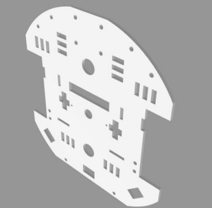
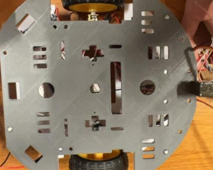

# 🚗 Chassis and Tire Design

The chassis and tires of the rover were designed using computer-aided design (CAD) software to accommodate the required circuits, sensors, and other components.

---

## 📐 **CAD Design**
The CAD design of the chassis was carefully crafted to fit all necessary components while maintaining durability and functionality.

---

## 🖨️ **3D Printing**
The chassis was 3D printed using polylactic acid materials (PLA), ensuring a lightweight yet sturdy construction.

---

## 🛠️ **Design Features**
- Lightweight construction to enhance maneuverability.
- Sturdy enough to support sensors, circuits, and other essential components.
- Modular design, allowing easy assembly and maintenance.

---

## 📊 **Material Used**
- **Material:** Polylactic Acid (PLA)
- **Printing Technique:** Fused Deposition Modeling (FDM)