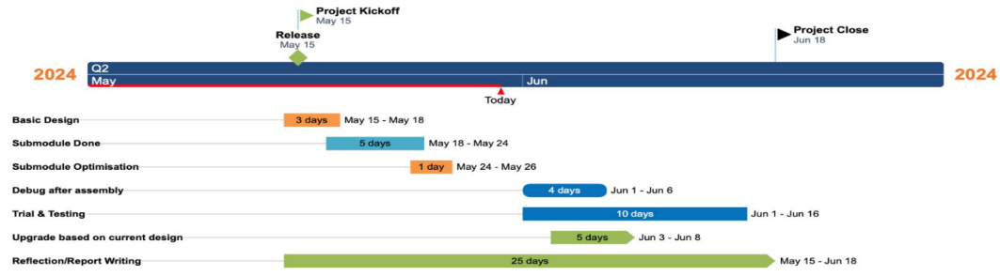
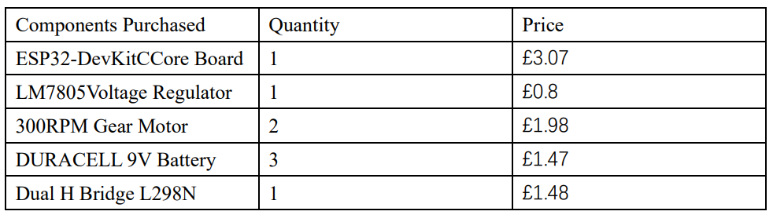

# 🗂️ Project Planning and Budget

This document outlines the project's planning and budget details, including the Gantt chart for project management and the cost breakdown of the components used in the rover design.

---

## 📅 **Project Planning**
The Gantt chart (Figure 1) below was used to represent the team's project planning. It outlines the timeline for each task, ensuring the team adhered to deadlines and maintained progress throughout the development phases.

---

## 💬 **Team Collaboration**
- Our team conducted regular meetings to divide tasks and responsibilities efficiently.
- Each team member was assigned specific tasks based on their strengths, ensuring balanced workload distribution.
- We emphasized communication and used the Gantt chart to track individual contributions and adjust priorities as needed.

---

## 💰 **Project Budget**
The team's rover design achieved all predefined goals with a relatively low cost. The following table outlines the components purchased and their respective costs:

| **Components Purchased**     | **Quantity** | **Price (per unit)** |
|-------------------------------|--------------|-----------------------|
| ESP32-DevKitC Core Board      | 1            | £3.07                |
| LM7805 Voltage Regulator      | 1            | £0.80                |
| 300RPM Gear Motor             | 2            | £1.98                |
| DURACELL 9V Battery           | 3            | £1.47                |
| Dual H Bridge L298N           | 1            | £1.40                |

---

## 🎯 **Key Takeaways**
- The Gantt chart facilitated effective project planning and ensured tasks were completed on time.
- Through strategic budgeting and resource management, we maintained a low overall cost without compromising quality.
- Team collaboration and task division played a crucial role in achieving the project milestones efficiently.
