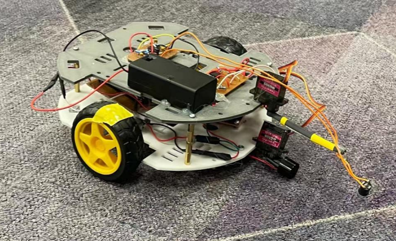

# 🛸 EEE Rover Project

**Group 29 - Electronics Design Project**



---

### 🌟 **Overview**
The **EEE Rover Project** is a collaborative engineering initiative designed to develop a remote-controlled rover capable of identifying and analyzing signals emitted by simulated lizards in an arena. The rover combines advanced hardware and software for multi-signal processing and provides users with real-time data through an intuitive web interface.

---

### 🚀 **Features**
- **Signal Detection & Processing**:
  - 🛰️ **Radio Signals**: Decodes modulated signals to identify lizard species.
  - 📡 **Ultrasound Signals**: Extracts digital data to display lizard names.
  - 🌈 **Infrared Signals**: Filters and analyzes peaks to identify frequencies for species recognition.
  - 🧲 **Magnetic Polarity**: Identifies the magnetic polarity to further distinguish species.

- **Remote-Control Functionality**:
  - Virtual joystick and user-friendly web interface for seamless rover operation.
  - Wi-Fi-based control with real-time data updates.

- **Lightweight, Compact Design**:
  - 3D-printed chassis and custom PCBs ensure portability and agility.

---

### 🛠️ **System Components**
| Component                 | Functionality                       |
|---------------------------|-------------------------------------|
| **ESP32 Microcontroller** | Processes signals and handles control commands. |
| **Radio Receiver Circuit**| Decodes lizard species from modulated radio signals. |
| **Ultrasonic Transceiver**| Detects and demodulates 40kHz signals. |
| **Infrared Phototransistor**| Analyzes IR frequencies for species identification. |
| **Magnetic Sensors**      | Detects and processes magnetic polarities. |
| **Web Interface**         | Provides a virtual joystick for user control. |

---

### 🔍 **How It Works**
1. **Signal Processing**:
   - Signals emitted by lizards are detected via onboard sensors.
   - Data is processed through circuits to extract meaningful insights (e.g., species names or frequencies).
   - Results are displayed on the web interface for real-time interaction.

2. **Rover Control**:
   - The rover can be maneuvered using a virtual joystick on the web interface.
   - Commands for forward/backward movement or turning are processed and executed via Wi-Fi.

3. **Real-Time Data Visualization**:
   - Signal data, including lizard species, is displayed dynamically on the web interface.

---

### 📊 **Project Outcomes**
- **Final Design**: A 25x25x15cm rover weighing under 750g.
- **Reliability**: Maintains consistent performance for at least 20 minutes.
- **User Interface**: Intuitive and accessible control interface for seamless operation.

---

### 🔮 **Future Improvements**
- **Chassis Redesign**: Optimize for better weight distribution and stability.
- **Enhanced Signal Processing**: Improve signal detection stability and expand range.
- **Energy Efficiency**: Integrate advanced motor control for longer operational times.
- **Sensor Upgrades**: Minimize environmental interference for improved accuracy.

---

### 🧑‍🤝‍🧑 **Team Members**
| Name             | Contribution                          |
|------------------|--------------------------------------|
| Flavio Gazzetta  | Integration & Infrared Signal Hardware Design |
| Michael Li       | Integration & Infrared Signal Analysis |
| Zecheng Zhu      | Ultrasound Signal Software & Reporting |
| Yufeng Wu        | Radio Signal & Magnetic Polarity     |
| Shenghong Liu    | Integration & Hardware Design        |

---

### 📂 **Repository Structure**
```plaintext
EEE_Rover_Project/
├── Images/                   # Images used across documentation
├── Plan_and_Design/          # Planning and designing resources
│   ├── Planning/
│   ├── Designing/
├── Technical_Modules/        # Signal detection and processing modules
│   ├── Radio_Signal/
│   ├── Ultrasound_Signal/
│   ├── Infrared_Signal/
│   └── Magnetic_Sensing/
├── Software/                 # Software for the rover and web interface
│   ├── Arduino_Sketches/
│   ├── Web_Interface/           
└── README.md                 # This README file
