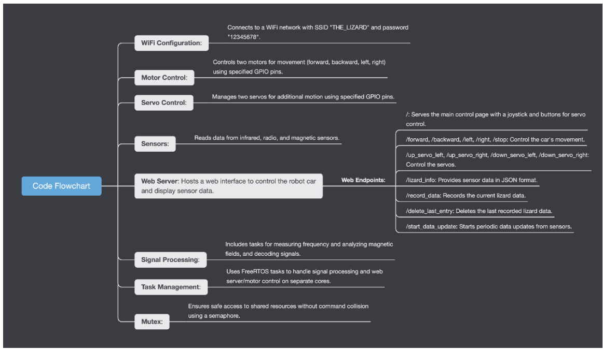
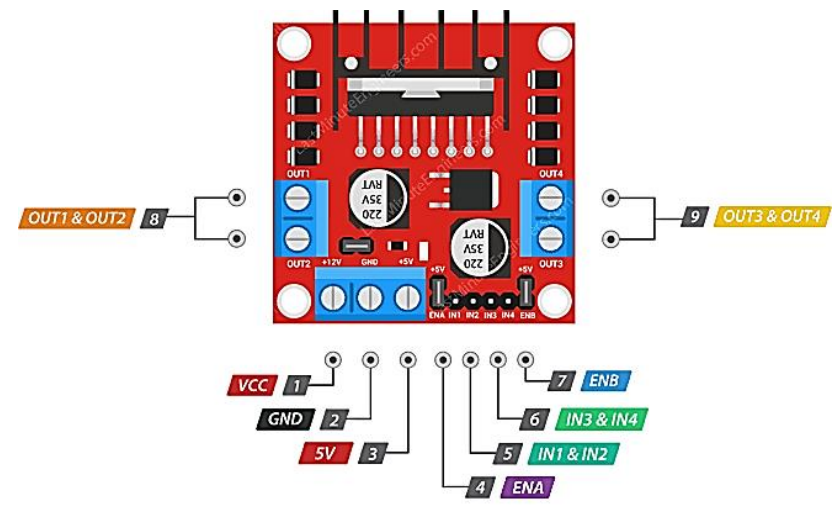
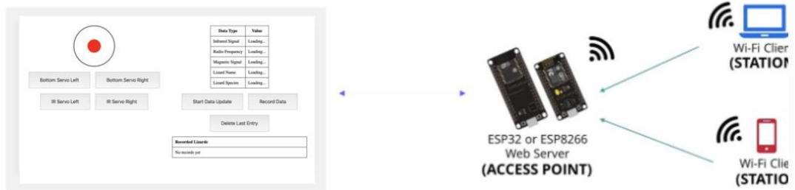

# 🛸 Rover Control & Webpage Interface (Wi-Fi Version)

This module integrates hardware and software to allow users to remotely control the rover and detect lizard species using a user-friendly HTML-based web interface.

---

## 🌐 **Overview**
The team implemented **four main movement functions** for the rover:
- **Move Forward**
- **Move Backward**
- **Turn Left**
- **Turn Right**

An **HTML webpage** was designed to provide a simple interface for controlling the rover and detecting lizard species. The system setup and functionalities are summarized in the flowchart below:

---

## 🧠 **Microcontroller Upgrade**
The ESP32 microcontroller replaced the Metro M0 Express board due to its:
- **Built-in Wi-Fi** for simplified design and reduced costs.
- **Increased RAM and Flash Memory** for supporting larger programs and data storage.
- **Dual-core design**, allowing simultaneous execution of sensor detection and control interface tasks.

---

## ⚙️ **Pins, Connections, and Setup**
The ESP32 acts as an **access point (AP) webserver** with the following setup:
1. Wi-Fi configuration:
   - SSID: `"THE_LIZARD"`
   - Password: `"12345678"`
2. **Analog input pins** for species detection sensors:
   - Infrared
   - Radio signals
   - Magnetic sensing
3. Initializes a webserver on **port 80**, enabling HTTP requests for remote interactions.

---

## 🚗 **Motor Control**
The rover utilizes a **differential drive mechanism**:
1. **Forward Movement**: Left and right motors have the same velocity (𝑉𝐿 = 𝑉𝑅).
2. **Turning**: Motors spin at equal speed but in opposite directions (𝑉𝐿 = -𝑉𝑅).

The **L298N motor driver** is used to control motor directions via pins IN1-IN4:

---

## 🖥️ **Webpage Server Setup**
The `setupWebServer()` function configures the ESP32 as a Wi-Fi access point and web server:
1. Provides remote interaction via a web interface.
2. Routes HTTP GET requests to control movement, detect lizards, and update data.

---

## 🎛️ **Webpage Interface (HTML Page)**
The HTML page allows users to:
1. Control rover movement using a **virtual joystick**.
2. Display and record **lizard species** dynamically.

### **Webpage UI Design**

### **UI Components**
- **Left Panel**:
  - Virtual joystick for movement control.
  - Servo control buttons for fine-tuning angles.
- **Right Panel**:
  - Data display for detected lizards.
  - Recorded lizard list management (add/remove entries).

---

## 🔄 **Submodules**

### 1. **Virtual Joystick Control**
A **red circle virtual joystick** handles user input to control the rover’s movement:
- **Functions**:
  - `sendCommandBasedOnPosition(x, y)`: Sends movement commands (`forward`, `backward`, `left`, `right`, `stop`) based on joystick position.
  - `sendCommand(command)`: Sends an HTTP GET request to the server with the desired command.

---

### 2. **Servo Control**
The servo module adjusts angles for signal detection:
- Moves servos left/right by small angles to optimize detection.
- Fine-tuning improves species identification accuracy.

---

### 3. **Lizard Data Update**
This submodule periodically updates the displayed lizard data:
- Fetches detection results every second using JavaScript.

---

### 4. **Data Recording**
Handles recording and deleting lizard data entries:
- **Functions**:
  - `recordData()`: Records new lizard data.
  - `deleteLastEntry()`: Deletes the last recorded entry.
  - `addRecordedLizard(species)`: Adds a detected lizard to the list.
  - `removeLastRecordedLizard()`: Removes the most recent entry.

---

## 📋 **Conclusion**
The Rover Control & Webpage Interface enables efficient and user-friendly control over the rover. The system leverages the ESP32's robust capabilities and a responsive HTML interface to provide seamless remote operation, dynamic lizard detection, and data management.

---
