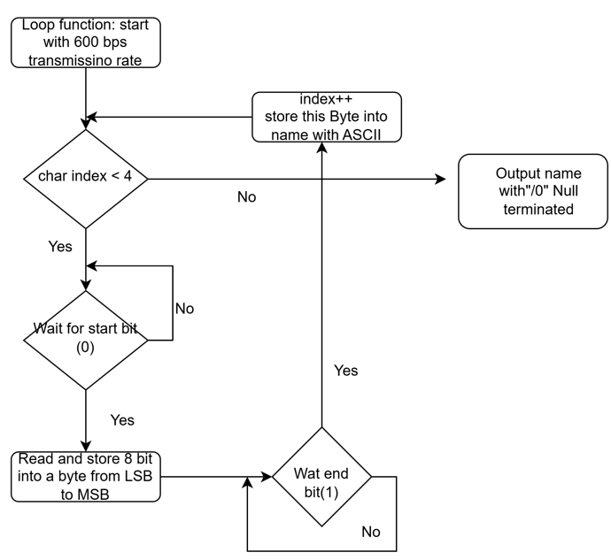
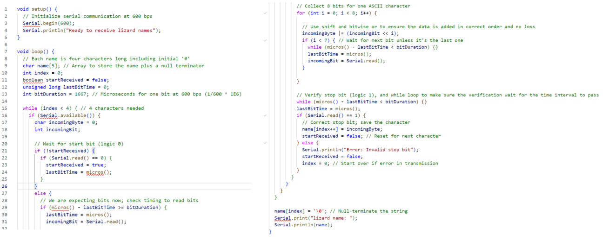

# 🦎 Lizard UART Decoding Software

This module handles UART decoding for lizard identification. The software reads a sequence of data transmitted at **600 bps** to extract a 4-character name, starting with a `#`. The implementation ensures efficient and accurate decoding using Arduino.

---

## 📋 **Key Features**
1. **Start/Stop Bit Detection**:
   - Uses a `bool startReceived`, initialized to `false`.
   - **Start bit (`0`)**: Sets `startReceived` to `true` and begins reading bits in the next loop.
   - **Stop bit (`1`)**: Resets `startReceived` to `false` and prepares for the next character.

2. **Time Interval Control**:
   - Ensures bits are read at correct intervals using:
     ```c++
     int bitDuration = 1667; // 600 bps
     if (micros() - lastBitTime >= bitDuration)
     ```
   - An empty `while` loop ensures the time interval for the last bit is completed:
     ```c++
     while (micros() - lastBitTime < bitDuration) {}
     ```

3. **Saving 8 Bits into a Byte**:
   - Uses a loop to shift bits into the correct positions:
     ```c++
     incomingByte |= (incomingBit << i);
     ```
   - The first bit is saved to the LSB, and the last bit is saved to the MSB.

4. **Output**:
   - Outputs the 4-character name, null-terminated (`\0`), via the serial monitor.

---

## 🔄 **Algorithm Flow**
The decoding process is outlined in the flowchart below:


---

## 🧑‍💻 **Code Implementation**
The following code snippet demonstrates the full implementation:


---

## 🖥️ **Example Input and Output**
### Input Transmission
The UART transmission for the output `#Zoe` has the following ASCII values:
- **#**: `0x23`
- **Z**: `0x5A`
- **o**: `0x6F`
- **e**: `0x65`

### Transmission Details
- **#**:
  - Start bit: `0`
  - Data bits: `00100011`
  - Stop bit: `1`
  - Transmission: `11000100` (LSB first)
- **Z**:
  - Start bit: `0`
  - Data bits: `01011010`
  - Stop bit: `1`
- **o**:
  - Start bit: `0`
  - Data bits: `11111010`
  - Stop bit: `1`
- **e**:
  - Start bit: `0`
  - Data bits: `10100110`
  - Stop bit: `1`

### Output
The serial monitor displays:
