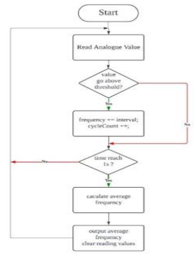
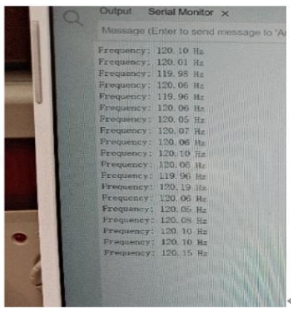
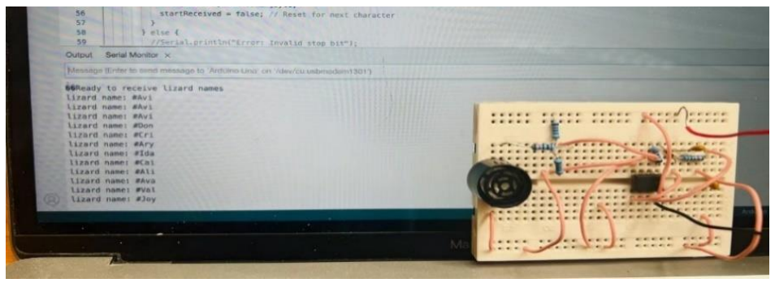
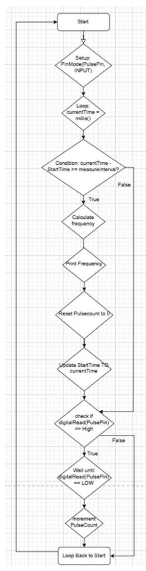
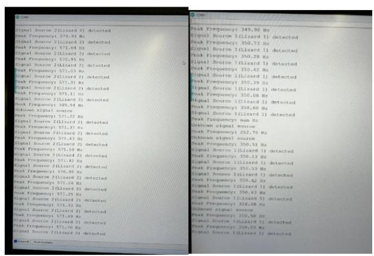
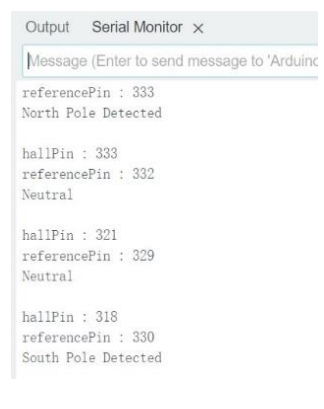

# 🧪 Module Testing

This document outlines the software testing performed on the Radio, Ultrasound, Infrared, and Magnetic signal processing modules. Each module was rigorously tested to ensure accurate detection and processing of the respective signals.

---

## 📡 **Radio Signal Software**

### **Overview**
This module processes analog signals to determine their frequency. The system counts the number of rising edges over a set period and outputs the calculated frequency to the serial monitor every 100 milliseconds.

### **Algorithm Design**
The following flowchart illustrates the logic used for frequency calculation:

### **Test Results**
Below is the serial monitor output showing successful detection of signal frequencies:

---

## 🛰️ **Ultrasound Signal Software**

### **Overview**
This module decodes lizard names from digital signals received in UART format. The program efficiently handles bit-reversal, start/stop bits, and stable output generation.

### **Algorithm Design**
The flowchart below describes the logic used for decoding lizard names:

### **Test Results**
During testing, stable results were observed for various lizard names, as shown below:

---

## 🌈 **Infrared Signal Software**

### **Overview**
This module calculates the frequency of infrared signals by counting peaks and determining the period. The simpler peak-counting algorithm was chosen over FFT-based processing to reduce complexity.

### **Algorithm Design**
The flowchart below describes the peak-counting algorithm for infrared signal processing:

### **Test Results**
The system successfully detected the frequencies of two lizard species during testing:

---

## 🧲 **Magnetic Signal Software**

### **Overview**
The magnetic module detects magnetic polarity to identify the lizard's orientation. The software identifies three states: North Pole, South Pole, and Neutral.

### **Test Results**
Below is the output showing the accurate detection of magnetic polarities:

---

## 🔬 **Conclusion**

The testing of all four modules demonstrated their ability to process signals accurately and provide reliable outputs. Each module's hardware and software integration ensures robust and efficient performance during operations.

---
