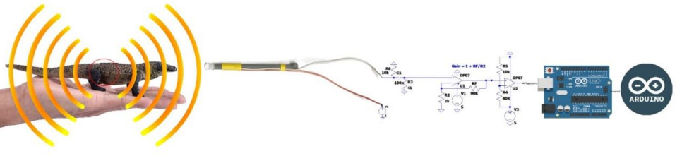
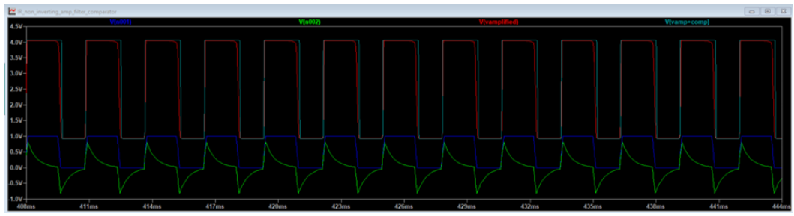
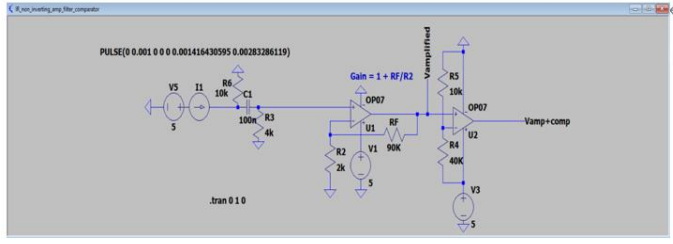

# 🌈 Infrared Signal Processing Module

This module detects and processes infrared signals emitted by lizards to identify their species.

---

**Infrared Processing Pipeline**  
   

---

## 🛠️ **Hardware Design**
### **Phototransistor Receiver**
- **Component:** EEEBug phototransistor.
- Detects infrared light and converts it into a voltage signal.

### **Signal Filtering**
1. **High-pass Filter**:
   - Removes the DC component to isolate rapid signal changes.
   - Resistor: 4kΩ, Capacitor: 100nF.
2. **Amplification**:
   - Non-inverting operational amplifier (MCP6022).
   - Gain: 46, achieved with resistors (2kΩ and 90kΩ).
   - Adds a 1V DC offset for better signal processing.

### **Comparator**
- Converts analog signals into digital waveforms with thresholds determined by a voltage divider.
- Outputs square pulses representing binary levels.

---

**Oscilloscope Output Waveform**  
   

---

### **Signal Processing Summary**
- The input waveform, represented by V(n001), is generated by a photodiode mixed with a resistor.
- This signal passes through a **high-pass RC filter**, which removes the DC component and highlights rapid changes. The filtered signal oscillates around 0V.
- The signal is then amplified by a **non-inverting operational amplifier (MCP6022)** with a gain of 46, producing a higher amplitude signal with a 1V DC offset.
- Finally, the amplified signal is fed into a **comparator**, which converts the analog signal into a digital waveform with voltage levels of 1V and 5V based on a 1V threshold. The output is a series of square pulses representing binary levels.

---

## 📊 **Test Results**
- Successfully identified frequencies of 571Hz (Abronia) and 353Hz (Dixonius).

---

## 🖼️ **Circuits**
Below are the images of the circuits for the Infrared Signal Processing module:

**Infrared Circuit**  
   
