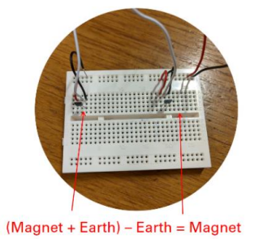

# 🧲 Magnetic Sensing Module

This module detects magnetic polarity to identify lizard species.

---

## 🛠️ **Hardware Design**
- The circuit compares the magnetic field from the magnet and Earth to detect polarity.

---

### **Signal Processing Summary**
- The magnetic sensing circuit measures the difference between the magnetic field of the magnet and Earth's magnetic field. 
- If the difference exceeds a threshold, the system outputs **North Pole** or **South Pole** based on the direction of the magnetic field.

---

## 📊 **Test Results**
- Successfully distinguished magnetic polarity into North, South, or Neutral zones.

---

## 🖼️ **Images**
1. **Magnetic Sensor Circuit**  
   
