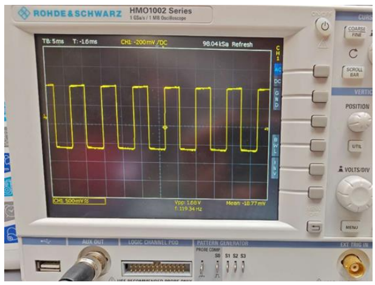
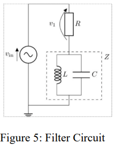
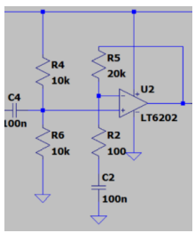
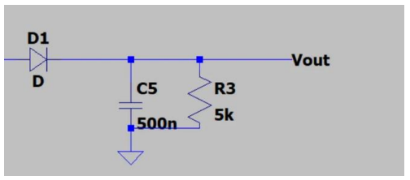
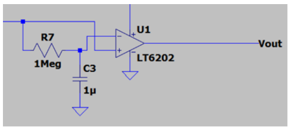
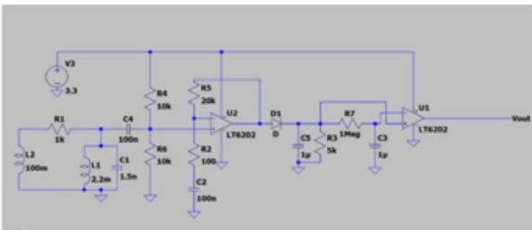
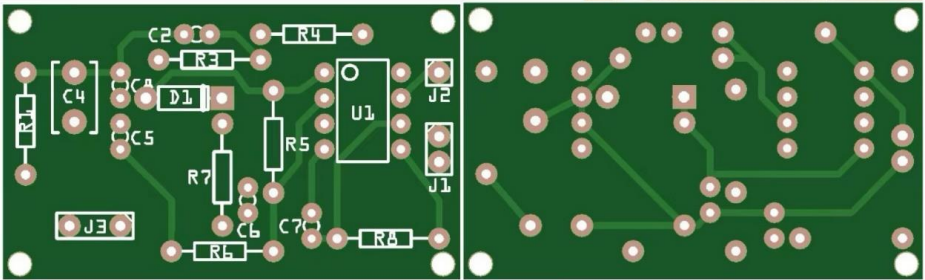

# 📡 Radio Signal Processing Module

This module processes radio signals emitted by lizards to identify their species (Elgaria or Cophotis).

---

## 🛠️ **Hardware Design**
### **Reception**
- **Inductor (100mH):** Chosen for its reliability at reasonable distances from the lizard.

### **Signal Processing Stages**
1. **Band-pass Filter**:
   - Filters out the carrier frequency of 89 kHz.
   - Uses an inductor (2.2mH) and capacitor (1.5nF) in parallel.
2. **Non-inverting Amplifier**:
   - Amplifies the signal by ~200x.
   - Adds a DC bias of 1.65V.
3. **Envelope Detector**:
   - Demodulates the AM signal to retrieve the original information signal.
   - Uses a resistor (5kΩ) and capacitor (500nF).
4. **Comparator**:
   - Converts the processed signal into a stable digital output.

---

**Oscilloscope Output Waveform**  
   

---

### **Signal Processing Summary**
- The radio signal is received by a 100mH inductor and passed through a **band-pass filter** to isolate the carrier frequency (89 kHz). 
- The filtered signal is amplified by a **non-inverting amplifier**, increasing its amplitude by 200x and adding a DC bias. 
- The amplified signal is demodulated by an **envelope detector**, retrieving the original signal. 
- A **comparator** converts the analog signal into a clean digital waveform for further processing.

---

## 📊 **Test Results**
- Successfully detected lizard species based on their radio signal frequencies.

---

## 🖼️ **Circuits**
Below are the images of the circuits for the Radio Signal Processing module:

1. **Band-pass Filter Circuit**  
   

2. **Non-inverting Amplifier Circuit**  
   

3. **Envelope Detector Circuit**  
   

4. **Comparator Circuit**  
   

5. **Full Circuit**  
   

6. **PCB Circuit**  
   
