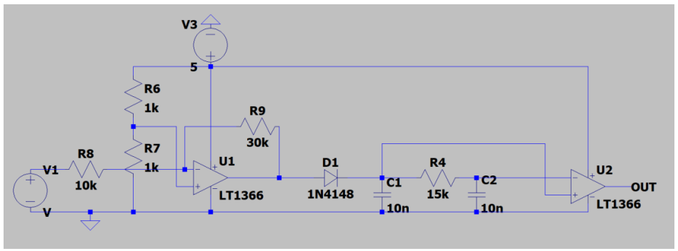
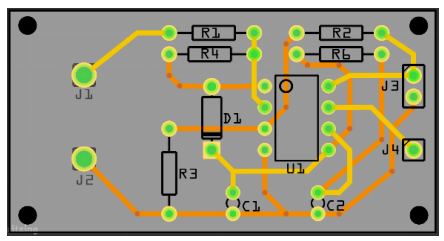

# 🔊 Ultrasound Signal Processing Module

This module processes modulated ultrasonic signals (40kHz) to extract digital data representing lizard names.

---

## 🛠️ **Hardware Design**
1. **Amplification**:
   - An inverting amplifier (gain: -3) is used to amplify the received signal.
2. **Envelope Detection**:
   - A diode removes the negative component of the signal.
   - A capacitor (10nF) reduces ripple voltage.
3. **Low-pass Filtering**:
   - Smoothens the signal for further processing.
4. **Comparator**:
   - Converts the processed signal into a clean binary output.

---

### **Signal Processing Summary**
- The ultrasound signal is received by a 40kHz transceiver and passed through an **inverting amplifier** with a gain of -3. 
- A **diode** and capacitor remove ripples and isolate the useful signal. 
- A **low-pass filter** smoothens the waveform before a **comparator** converts it into a binary digital output, which can be processed by UART.

---

## 📊 **Test Results**
- Successfully detected lizard names encoded in ultrasonic signals.

---

## 🖼️ **Circuits**
1. **Ultrasound Circuit**  
   

2. **PCB Circuit**  
   
